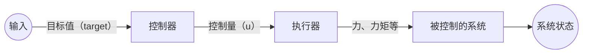
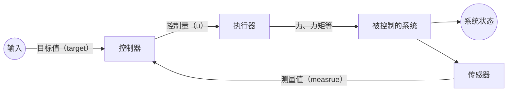
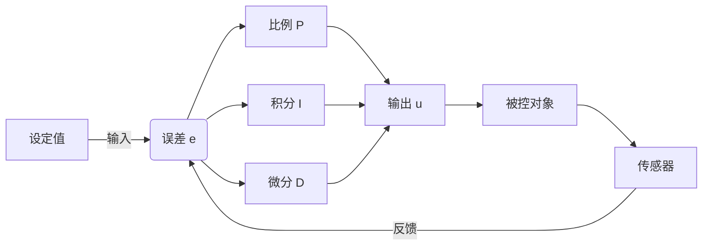

# 理解 PID 控制器

PID，比例-微分-积分控制，是大部分控制人的第一课。

从 PID 开始，“电控” 不再只是电子电路、寄存器和代码，而是建立在此基础上的控制，成为真正的电**控**。

通过 PID 控制算法，你可以很容易的控制电机旋转、平衡车等许多以前难以控制的系统。

## 控制是什么

控制就是通过某种方法，让系统达到目标状态。

### 系统和状态

如果我们控制一个平衡车，就可以把它叫做一个系统，它是我们控制的对象。

系统本质就是一个函数：输入一个量，然后输出状态的变化:

$$
u = \begin{pmatrix} 电机力矩 \end{pmatrix} \\
x = \begin{pmatrix} 倾角 \\ 倾角角速度 \\ 位移 \\ 速度 \end{pmatrix} \\
\dot{x} = f(x,u)
$$

u 叫控制量，x 叫状态变量，f 就是这个平衡车系统。

通过力学和运动学建模，函数 f 是可以写出来的，但大多数时候它都相当复杂。

### 开环和闭环

通过某种规律直接控制，而不去检查到底有没有达到目标，这是开环控制：

检查了当前状态和目标的差距，再根据这个差距去控制，这是闭环控制：

开环大部分情况都不一定能达到目标，而闭环通过了解还差多少，可以更逼近目标。

PID 是闭环控制。

## PID 公式

PID 最原始的公式长这样：

目标值和测量值的误差为 e (error)：

$$
e = x_{target} - x_{measure}
$$

对于控制量 u，设 $T_i$ 是积分时间，$T_d$ 是微分时间，有

$$
u = K_p ( e + \frac{1}{T_i} \int^t_0 e \ dt + T_d \frac{de}{dt} )
$$

这个公式实在反人类，所以简化：

$$
u = K_p \cdot e + K_i \cdot \int e + K_d \cdot \dot e
$$

> $\dot e$ 即 e 的微分，这是一种常用的表示。

我们发现它分三项：

- 比例项：e 乘比例

- 积分项：积分乘比例

- 微分项：微分乘比例

比例（Proportion），积分（Integration），微分（Differentiation），取首字母故曰 PID。

这三个比例就是我们需要手动调的参数。

为了理解 PID 我们一项一项的理解。

## 感性地理解 PID

假设光滑平面有一个小木块，目标是让它到某个位置（状态量），手段是给它施加一个力（控制量）。

令位移是 x，目标是 $x_0$，力 F = u，则 $e = x_0 - x$。

### 只有比例项（P 控制）

根据常识，我们会**反方向**拉木块，并且离 $x_0$ **越远越用力**，即：

$$
u = K_p \cdot e
$$

这时 $K_p$ 越大，反应越大。

但我们不幸的发现，这就是是**胡克定律**：控制器相当于**弹簧**，木块做简谐运动！

考虑阻力时，确实会逐渐停止，但不一定停得快，正常我们也不希望有摩擦。

### 弹簧阻尼：比例 + 微分（PD 控制）

于是手动加阻力，让输出减速.

微分（导数）就是速度，让阻力和速度成正比，于是：

$$
u = K_p \cdot e + K_d \cdot \dot e
$$

微分项可以理解为根据误差变化率提前“刹车”，抑制超调与震荡（目标值恒定时，$\dot e = \dot x_0 - \dot x = -\dot x$，此时微分项与木块速度负相关）。这时的 PD 控制器就是**有阻力的弹簧**：震幅度减小，逐渐停在 $x_0$。

其实微分项也可以理解为：

$$
K_d \cdot \dot e = -K_d \cdot \dot x
$$

即通过误差的变化率，间接对木块速度进行调节：x 偏离目标远时，位移项发力；接近目标时，误差变化率主导，让木块速度逐渐趋近于 0。

PD 控制器，在没有持续外力干扰时，大部分情况够用了。但如果加个外力呢？

### 静态误差：加积分（PID 控制器）

如果存在一个给物块的外力。

前面说 PD 控制即带阻力的弹簧，据高中物理，弹簧受恒外力，最终会保持一个形变：

- 当稳定时，$\dot e = 0$，而 $F_{外力} = u = K_p \cdot e$。为了抵消恒外力，最终 e 会恒定在一个值，造成稳态误差

这有点像小学水池一边加水、一边放水的问题？

为了衡量误差持续时间，其造成的影响，于是把 e 对时间积分：

$$
u = K_p \cdot e + K_i \cdot \int e + K_d \cdot \dot e
$$

一直偏移，就一直积分，积分项就不断增大，最终抵消误差。

我们最终得到了完整的 PID 控制器。
