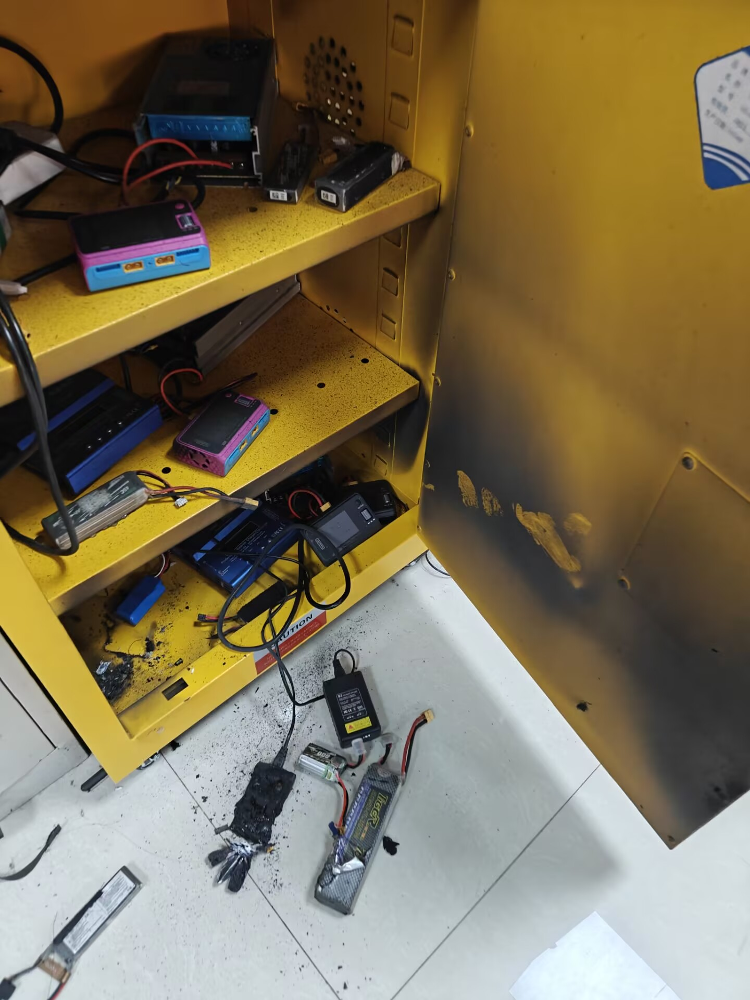
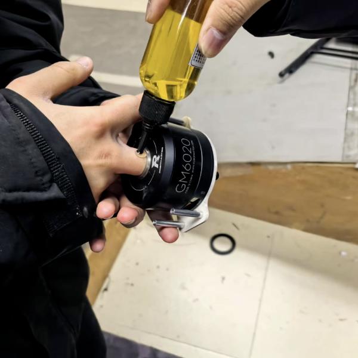

# RM 实验室安全

## 硬件安全

1. 人走焊台关，烙铁、热风枪、焊台在离开时必须关闭
2. 小心烙铁烫坏电源线，导致短路起火

## 电源安全

1. 损坏电池，理应禁止继续使用和充电
2. 小心摔碰等暴力导致电池损坏
3. 充电时需要有人看在场，实验室无人后断电

> 前车之鉴：
>
> 

## 调车安全

1. 还不确定程序安全性的情况，先固定机器人，防止腿、大臂、底盘伤人，也防止车损坏

2. 注意电池电量，防止电池过放损坏电池

3. 遥控器不要离车太远，否则有遥控器失联后失控风险（如出现请压力电控）

4. 不要把遥控器交给非队伍成员

## 机械安全

1. 

## 其他

1. 不要把手指伸到 GM6020 电机中

   > [【关于我手插进6020拔不出来的一件事】](https://www.bilibili.com/video/BV1AE9SYpESF)
   >
   > 经典回顾：
   >
   > 

---

> to be continue ->
