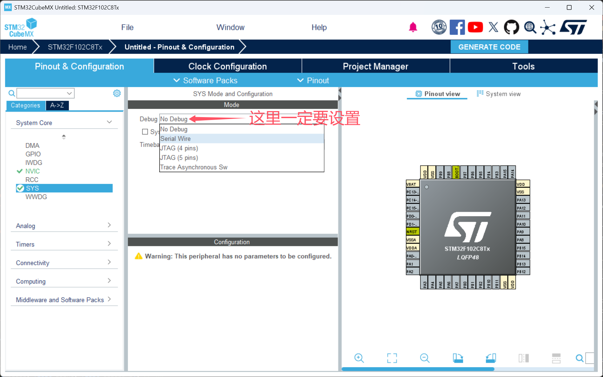
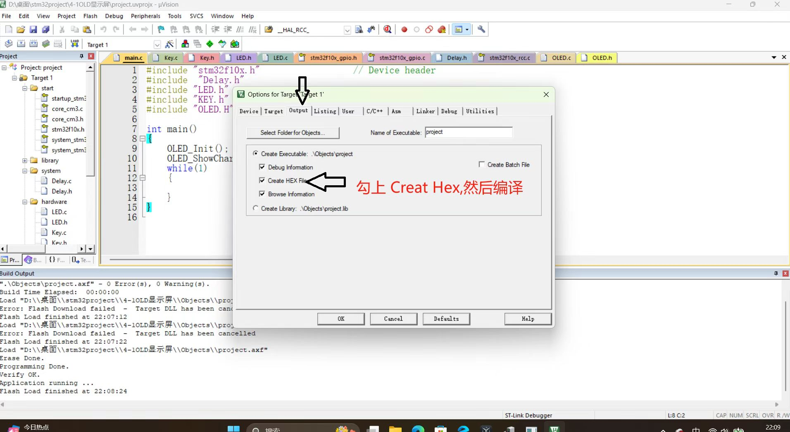
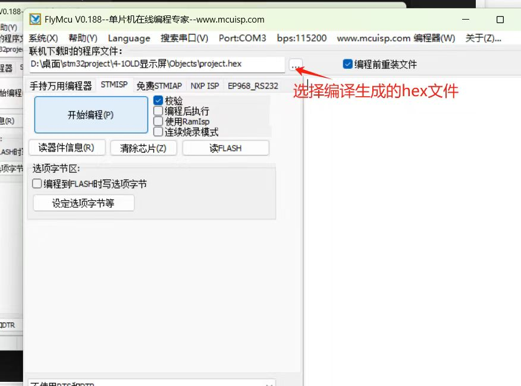
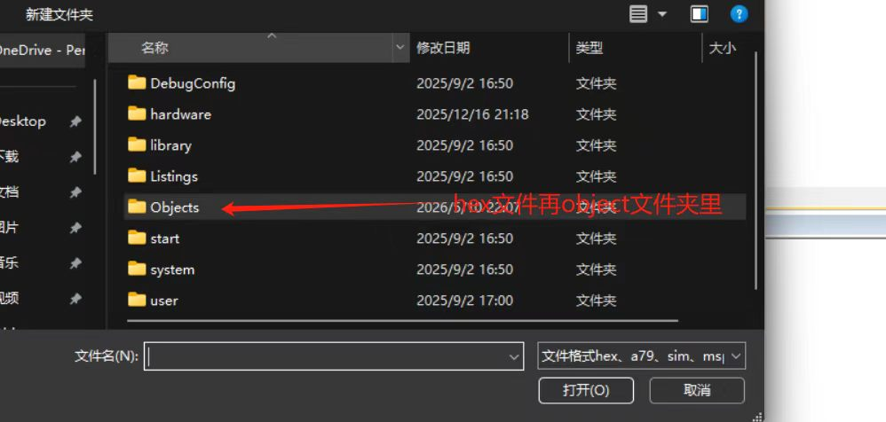
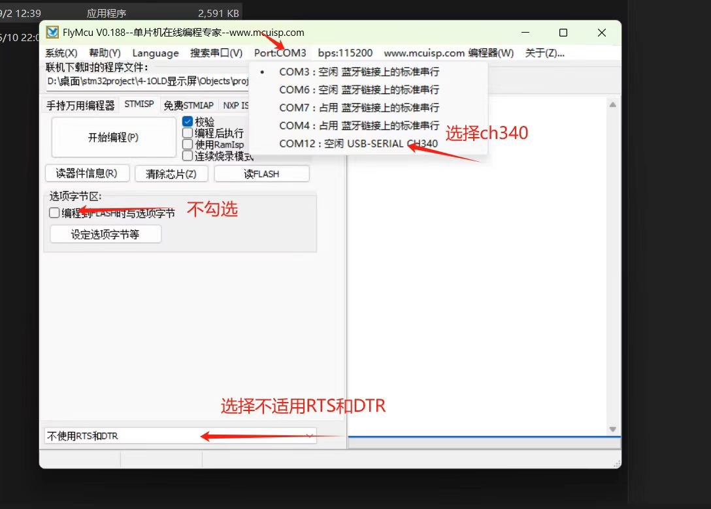

# STM32 芯片锁死的解决

## 原因

1. 没设置烧录方式，导致sw烧录口无法用

	

## 串口烧录法

可解决没设debug为sw造成的问题。

1. 下载 FlyMcu

2. 将 BOOT 0 引脚接高电平

3. 编译二进制 hex 源文件

	

4. 在 flymcu 中选择 hex文件

	

	

5. 把 stm32 的串口用 TTL 转 USB 模块连接电脑

6. 设置 flymcu

	

7. 用 flymcu 烧录

8. 将 boot0 接地 然后正常烧录