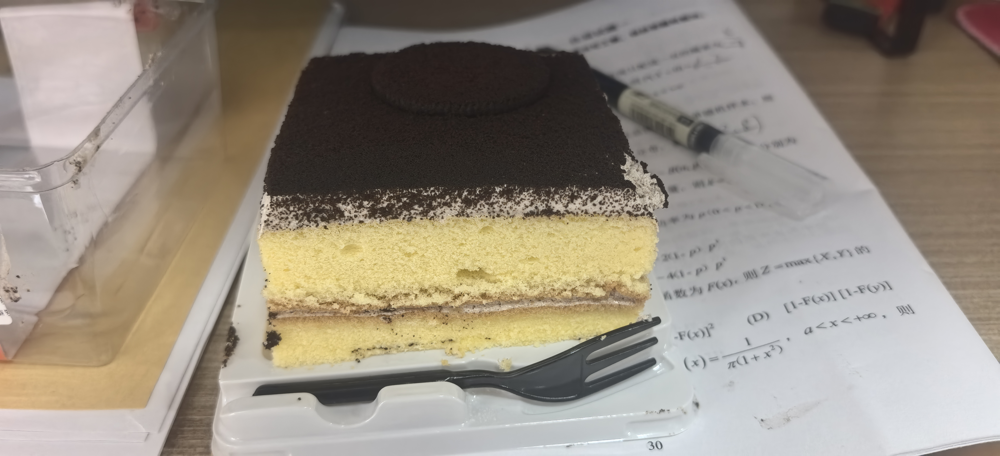
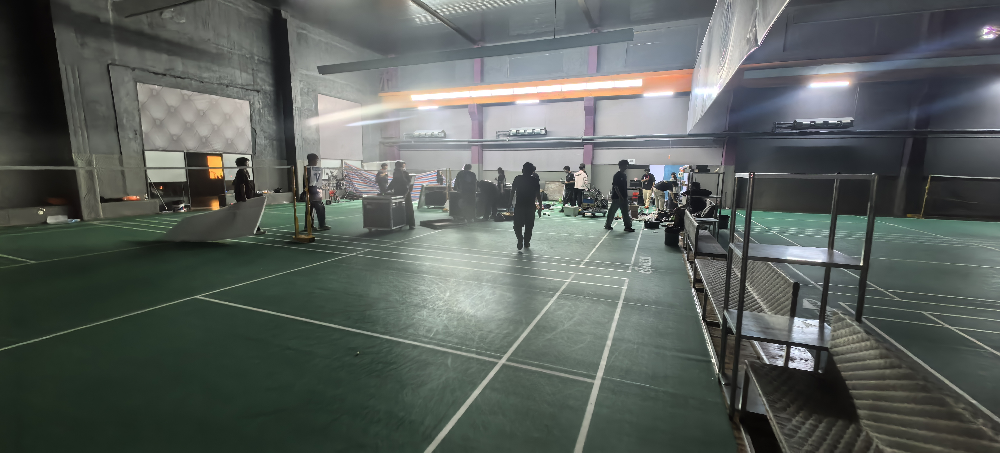
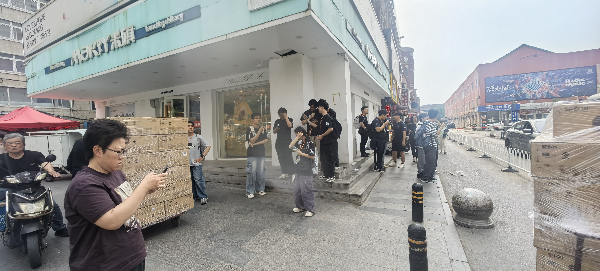
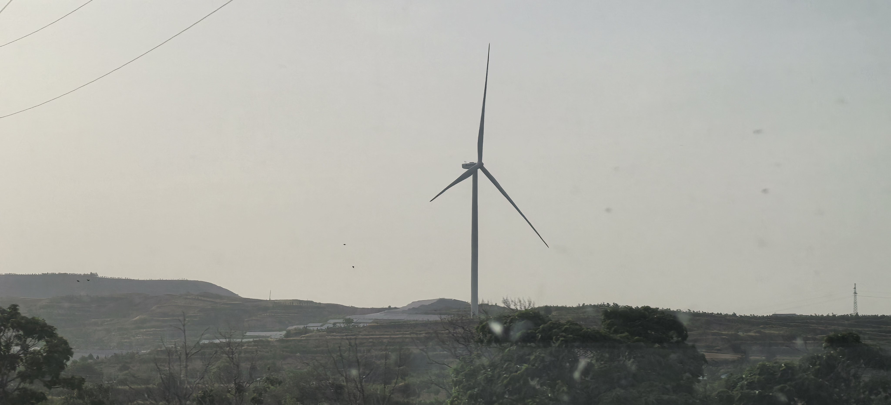
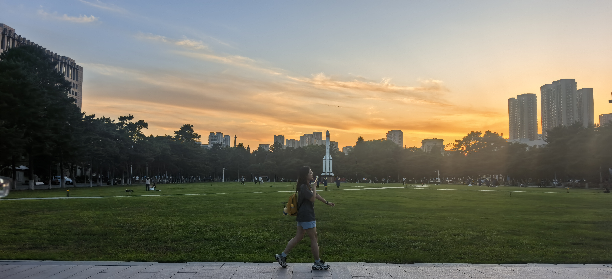

2026，生日快乐。

<iframe frameborder="no" border="0" marginwidth="0" marginheight="0" width=330 height=86 src="//music.163.com/outchain/player?type=2&id=2727346621&auto=1&height=66"></iframe>

遗憾是春留在夏的落花，风融化不敢诀别春的我。

明天会更好吗？
