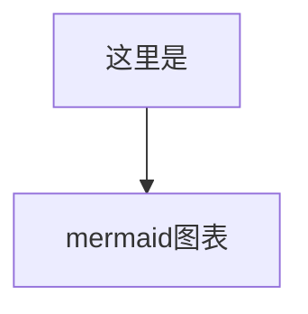

# Markdown、Tex和Mermaid

## 介绍

Markdown 是一种简单的标记语言，他比 HTML 更简单，更易读，而且可以渲染为 HTML。

Tex 是一种常用于公式排版的语言，常用于论文等需要数学物理公式的文档。他也可以被渲染，不过往往渲染为 pdf。

Markdown 常常和 Tex 配合使用，比如使用 Latex 语法来写公式。这种方式非常方便，而且易于移植。

## 学习

Markdown 基础教程：[Markdown 基本语法 | Markdown 教程](https://markdown.com.cn/basic-syntax/)

菜鸟教程的 Tex 公式教程：[Markdown 数学公式 | 菜鸟教程](https://www.runoob.com/markdown/md-math.html)

同样是菜鸟教程 Mermaid 学习：[Markdown 图表绘制 | 菜鸟教程](https://www.runoob.com/markdown/md-draw.html)

菜鸟教程的其他内容也可以看看，较为简单，相当适合新手（菜鸟教程不负起名）

Mermaid 的官方教程。这个语言还有好多神奇的语法，不过我不会hh：[Mermaid 用户指南 | Mermaid 中文网](https://mermaid.nodejs.cn/intro/getting-started.html)

## 使用

现在有着许多 Markdown 的编辑软件，如 Obsidian 和 Typora 等。我目前主要使用 Typora。

> [Typora 资源](\download\typora-setup-x64.exe)
>
> [Typora 解锁软件](\download\Typroa_Activation_Script.7z)

大部分编辑器都支持行内、行间公式和 Mermaid 渲染，有的可能需要手动开启如 Typora。

Markdown 常缩写为 md，文件后缀名也通常为`.md`。

同时，如知乎等平台都包括 Markdown 功能，Github 项目常用 Markdown 作为 README 等的文档。

## 示例

Markdown 代码如下：

````markdown
# 一级标题
## 二级标题
### 三级标题
#### 四级标题

**加粗** 

*斜体*

- 无序列表
- 表列序无

1. 有序列表
2. 表列序有

$$
公式 \\
E = mc^2
$$

`行内`代码

```c
printf("行间代码");
```


````

实际渲染效果如下：

---

# 一级标题
## 二级标题
### 三级标题
#### 四级标题

**加粗** 

*斜体*

- 无序列表
- 表列序无

1. 有序列表
2. 表列序有

$$
公式 \\
E = mc^2
$$

`行内`代码

```c
printf("行间代码");
```


