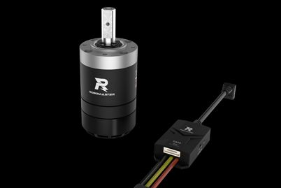
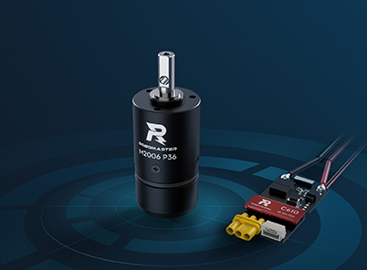
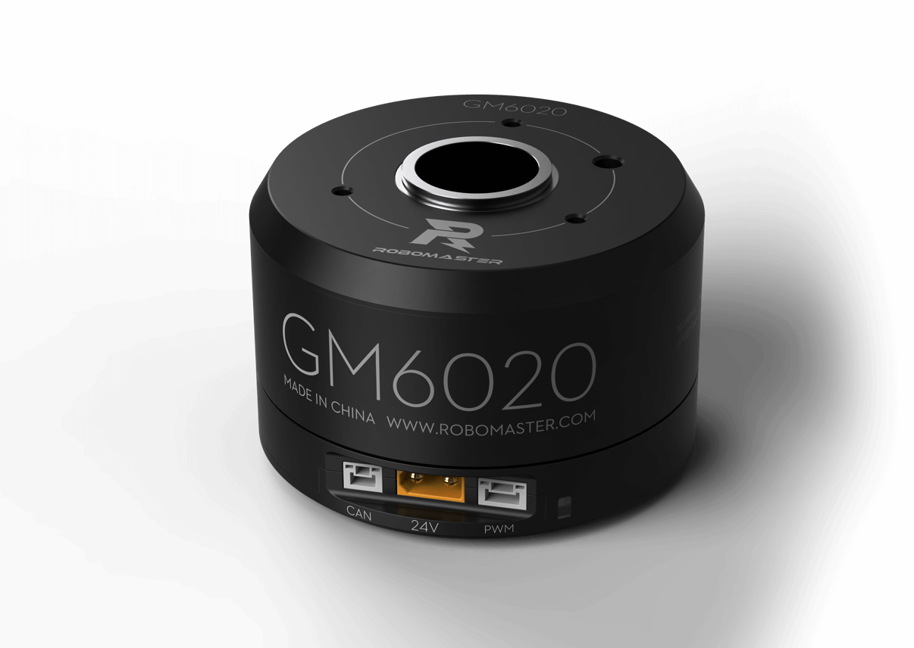
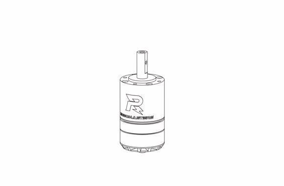
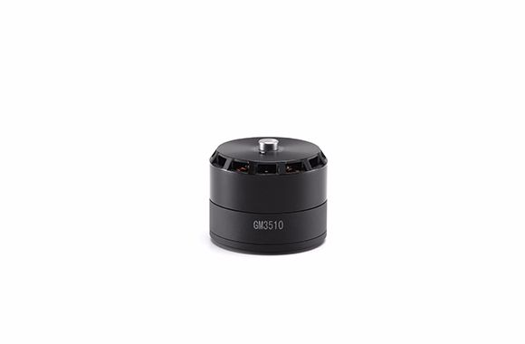
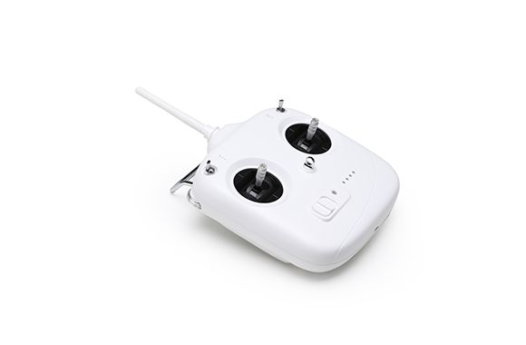
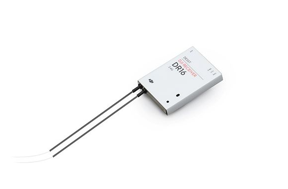
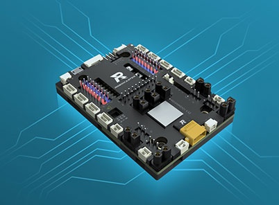
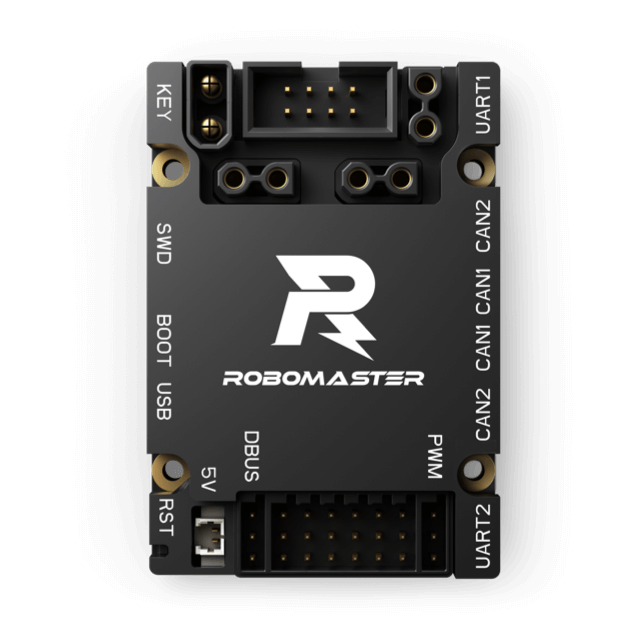

# RM物资目录

> 持续更新ing

## 电机和电调

### M3508 & C620

[M3508减速电机套装](https://www.robomaster.com/zh-CN/products/components/general/M3508)

最常见的直流减速电机，提供动力。

1. 通常作为轮毂电机，驱动底盘运动
2. 减速箱可拆卸，无减速箱时可用做发射的摩擦轮电机
3. 搭配 C620 电调（右侧），与电机之间由 7pin GH1.25 编码器线和三相线连接

### M2006 & C610

[M2006 动力系统](https://www.robomaster.com/zh-CN/products/components/general/M2006)

小型电机，是M3508的轻量版。

1. 可作为供弹拨盘电机，或其他较小的地方
1. 搭配 C610 电调（右侧），4 pin GH1.25 编码器线和三相线

### GM6020

这是一款**云台**电机，常用于 pitch 轴和 yaw 轴上（即云台电机），也可用作舵轮的舵向电机。

1. 中空（空心轴），可放置直径 <=18mm 的导电滑环
2. 反馈角度是绝对位置，不因断电改变零点位置
3. 内置电调，直接连接 CAN 总线
4. 可以使用电流或电压控制电机，电流控制需要使用上位机设置打开

### 3510

[RoboMaster 3510减速电机](https://www.robomaster.com/zh-CN/products/components/detail/140)

[RoboMaster 820R 电调](https://www.robomaster.com/zh-CN/products/components/detail/136)

很古代的电机，大概是 M3508 的远古版本，搭配 820R 电调使用，都已绝版不再使用。

### GM3510

[RoboMaster GM3510 直流无刷电机](https://www.robomaster.com/zh-CN/products/components/detail/127)

同样古代的电机，绝版不再使用。内置电调，接口是 XT30 和 can（类似 GM6020）。

## 遥控器

### DT7 & DR16

[RoboMaster 遥控器套装](https://www.robomaster.com/zh-CN/products/components/detail/122)

较古老但一直在使用的大疆官方遥控器，指定比赛用遥控器，要珍惜使用。可在大疆开发板上直接使用。

DT7 是遥控器，DR16 是对应的接收器。DR16 使用 DBUS 协议（似乎就是 UART 电平反相）和主控板通信。

长戳 DR16 正面右侧孔内，直到LED 绿色闪烁，接收器进入配对状态，可以重新绑定附近的 DT7 遥控器（匹配时靠近一点，远离其他开着的遥控器，否则很可能绑到其他遥控器上）。

## 大疆开发板

常用的板子有 A、C 两个型号。一般一辆车云台和底盘一共两块主控板，通常分别为 C 板和 A 板。

### A 板

[RoboMaster开发板套件](https://www.robomaster.com/zh-CN/products/components/general/development-board?from=online-store)

A 板常用于底盘，芯片型号是 STM32F407。A 板有陀螺仪，不过不怎么用。

A 板的重要接口有

- CAN 1 * 4
- CAN 2 * 4
- UART * 3
- Micro B USB
- XT30 母 * 4（需要软件开启，默认没有电）

A 板的接口大部分是卧式

### C 板

[RoboMaster 开发板 C 型](https://www.robomaster.com/zh-CN/products/components/general/development-board-type-c)

C 板常用于云台，芯片型号是 STM32F427。他有 BMI088 陀螺仪和一个磁力计，所以常作为云台控制板。

C 板的重要接口有

- CAN 1* 2
- CAN 2 * 2
- UART * 2
- Micro B USB
- XT30 母 * 3 （不需要开启直接可以用）

注意 C 板的接口大部分是卧倒式

### B 板

相当少见，还没用过（x）

## 裁判系统（TODO）

裁判系统是比赛时使用的系统，一般大疆比赛时会提供借用（如果买不起足够多套），模块之间使用 4pin 航空线通信和供电，和主控板使用 UART 串口通信。

裁判系统的串口通信协议每年都会有一定变动，具体细节需要查看各赛季的比赛手册。

### <!--主控-->

### <!--图传-->

### <!--电源管理（电管）-->

### <!--弹丸充能-->

### <!--RFID 场地交互模块-->

### <!--UWB-->
